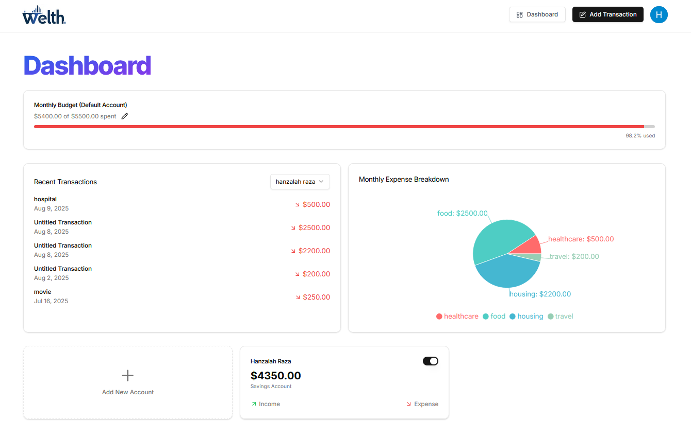
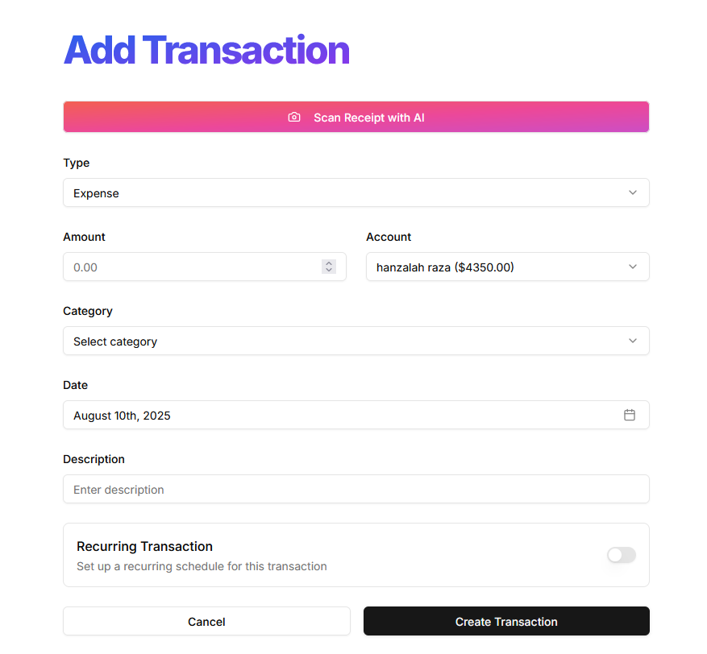

# 💰 AI Finance Platform

An intelligent personal finance management platform built with **Next.js 15**, **React 19**, and **Tailwind CSS** — powered by AI to help users track expenses, manage budgets, and receive automated financial insights.

---

## 🚀 Features

- 📊 **Expense Tracking** – Log and categorize your daily transactions.
- 📅 **Recurring Transactions** – Automate repetitive income and expense entries.
- 📈 **Budget Alerts** – Get notified when you’re close to exceeding your budget.
- 🤖 **AI Insights** – Personalized tips for improving financial health.
- 📬 **Automated Email Reports** – Monthly summaries sent directly to your inbox.
- 🎨 **Responsive UI** – Modern and mobile-friendly interface.

---

## 🛠️ Tech Stack

- **Frontend:** Next.js 15, React 19, Tailwind CSS, Radix UI  
- **Backend:** Next.js API Routes, Prisma, PostgreSQL  
- **AI:** Google Generative AI API  
- **Authentication:** Clerk  
- **Email Service:** Resend  
- **Task Scheduling:** Inngest  

---

## 📷 Screenshots

### 🏠 Home Page

### 📊 Dashboard

### ➕ Add Transaction

---
